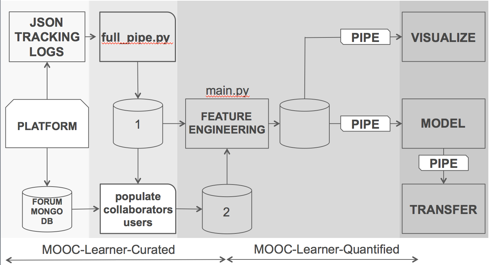
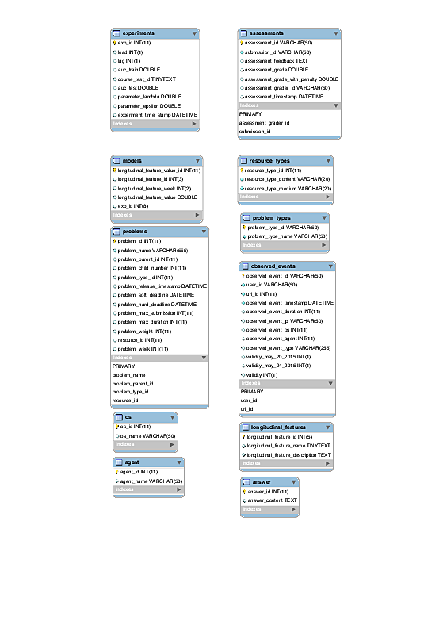

# Translate-Curate

Documentation regarding the `MOOCdb` schema, workflow, description of workflow and the design of the code.

## Documentation of the Schema

Documentation of the schema includes users and collaborations tables. It can be found [here as pdf](MOOCDB_Schema_DOC.pdf).
Other descriptions is at _Sebastien Boyer, Ben U. Gelman, Benjamin Schreck, and Kalyan Veeramachaneni. [Data science foundry for moocs](DataScienceFoundry-DSAA-2015.pdf). In Data Science and Advanced Analytics (DSAA), 2015. 36678 2015. IEEE International Conference on, pages 1–10. IEEE, 2015._

#### Graphic documentation of the Schema

We have 3 different EER graphics:
-  [full schema](EERs/EERDiagram-20131122.pdf)
-  [schema from full_pipe.py, no collaborations or users tables](EERs/201x_2013_Spring_fullpipe_20161109.pdf)
-  [schema after digitalLearnerQuantified](EERs/201x_2013_spring_20161109.pdf)

## Graphics of Workflow
__High Level__


__Details of Forum and JSON log processing:__

JSON log processing is required before the forum data is translated into the moocdb Users and Collaborations tables, 
but it is not strictly necessary before variable engineering.



## Overview on JSON curation

A description on how to use a generated sample from your data and run the translate-curate step. It describes:
- Required folder structures, files and configuration file path names
- Folder structure created by MLC `full_pipe.py` script
- Translation of `*.json` files to intermediary `*.csv` files
- Processing of events in the intermediary `*.csv` files
- Creation of `MySQL` database for the data
- Filling of `MySQL` database for the data
- Curation of `MySQL` database



### Disk Space Requirements
You will need disk capacity about 3x the size of your tracking logs.

### Description of `full_pipe.py` executing with sample tracking logs

This is a step by step description of how `full_pipe.py` executes on a sample of an Edx tracking JSON log file. 
It provides a hands on description on how to use a generated sample the translate-curate step. It describes:

-	Required folder structures, files and configuration file path names
-	Folder structure created by MLC `full_pipe.py` script
-	Translation of `*.json` files to intermediary `*.csv` files
-	Processing of events in the intermediary `*.csv` files
-	Creation of `MySQL` database for the data
-	Filling of `MySQL` database for the data
-	Curation of `MySQL` database

We will use the `MITx-2.01x-2013_Spring` course data, but you should be able to generate a sample with 
other course data following more or less the same steps. 

1) Create a data folder and move the course data into it. I will create my data directory in my home folder.

```
~$ mkdir data
~$ cp -r /home/stuff/201x-2013-Spring/ ~/data
```

2) Remove any files that are not part of the log_data folder. This step may not be strictly necessary but we want to 
make sure we are in a clean state.

```
~$ cd ~/data/201x-2013-Spring
~/data/201x-2013-Spring$ ls
log_data  moocdb_csv

~/data/201x-2013-Spring$ rm -rf moocdb_csv/
```

3) Go into the log_data folder and make sure that you have a tracking log file, `*.json` or `*.json.gz`. The other files
 are not necessary to run `full_pipe.py`.

```
~/data/201x-2013-Spring$ cd log_data/
~/data/201x-2013-Spring/log_data$ ls
MITx-2.01x-2013_Spring___2014_08_10___tracking_log.json.gz  MITx-2.01x-2013_Spring___2014_08_17___studentmodule.csv
MITx-2.01x-2013_Spring___2014_08_17___certificates.csv      MITx-2.01x-2013_Spring___2014_08_17___user_id_map.csv
MITx-2.01x-2013_Spring___2014_08_17___enrollment.csv        MITx-2.01x-2013_Spring___2014_08_17___users.csv
MITx-2.01x-2013_Spring___2014_08_17___forum.mongo           MITx-2.01x-2013_Spring___2014_08_17___wiki_article.csv
MITx-2.01x-2013_Spring___2014_08_17___profiles.csv          MITx-2.01x-2013_Spring___2014_08_17___wiki_articlerevision.csv
```

4) Now we want to generate a sample. `cd` to the `sample_tutorial` folder containing this `README.md` file. It should be
located inside wherever you cloned the Translation_software repo.

```
~/data/201x-2013-Spring/log_data$ cd ~/sample_tutorial/
```

5) `cp` the tracking log file over to the `sample_tutorial` directory. Decompress the file if it is compressed.

```
~/sample_tutorial$ cp ~/data/201x-2013-Spring/log_data/*json.gz .
~/sample_tutorial$ gzip -d *json.gz
```

6) Execute the `generate_sample.py` script. The first argument is the input file path (relative or absolute) of the JSON 
tracking log file, and the second (optional) argument is the output file path (relative or absolute). On the 
201x-2013-Spring tracking log, it should take approximately 5-10 minutes. When it is complete you should see a lot of 
output in how many lines the generated sample contains. If you run `ls -lh` you should see a significantly smaller 
sample tracking log file.

```
~/sample_tutorial$ python generate_sample.py MITx-2.01x-2013_Spring___2014_08_10___tracking_log.json MITx-2.01x-2013_Spring___2014_08_10___tracking_log_sample.json

...

/courses/MITx/2.01x/2013_Spring/xblock/i4x:;_;_MITx;_2.01x;_problem;_HW3_1b/handler/xmodule_handler/problem_get
/courses/MITx/2.01x/2013_Spring/xqueue/1656262/i4x://MITx/2.01x/problem/E0_7/score_update
/courses/MITx/2.01x/2013_Spring/xqueue/1525643/i4x://MITx/2.01x/problem/E2_1aX/score_update
Generated sample has 50580 lines

~/sample_tutorial$ ls -lh
total 7.3G
-rw-rw-r-- 1 austin_liew austin_liew 1.8K Nov  9 05:51 generate_sample.py
-rwxr-xr-x 1 austin_liew austin_liew 7.3G Nov 10 03:44 MITx-2.01x-2013_Spring___2014_08_10___tracking_log.json
-rwxrwxr-x 1 austin_liew austin_liew  38M Nov 10 03:53 MITx-2.01x-2013_Spring___2014_08_10___tracking_log_sample.json

```

7) Now we need to replace the original tracking log file in the course data folder with the generated sample. 
*Make sure it does not include the `_sample` in the filename of the sample we just generated!* It is important to 
remove the original tracking log file, because `full_pipe.py` will terminate early if it finds more than one tracking 
log file.

```
~/sample_tutorial$ rm ~/data/201x-2013-Spring/log_data/*json.gz
~/sample_tutorial$ cp MITx-2.01x-2013_Spring___2014_08_10___tracking_log_sample.json ~/data/201x-2013-Spring/log_data/MITx-2.01x-2013_Spring___2014_08_10___tracking_log.json
```

8) The above step completes the preparation of the data folder and the generation of the tracking log sample. Now we 
need to configure variables used by `full_pipe.py`. Change the following variables located in the 
`<Translation_software cloned repo>/edx_pipe/qpipe/config.yml` so that they point to the appropriate locations for your 
own environment or the right values for this particular course (MITx-2.01x-2013_Spring):

9) Now we're ready to finally run `full_pipe.py`. `cd` to the folder that contains the script and run 
`python full_pipe.py`. The steps should be fairly easy to follow within `full_pipe.py` but I have included my output so 
you have an idea of what to expect. Note that if you have already run `full_pipe.py` on the data that you are running 
it on now, you do not need to repeat the steps that you already completed. 

```
~$ cd ~/
~$ python full_pipe.py
```

Step 1:

```
###### Step 1 : Do you want to create folder environment for Log transformation? (default: y) [y/n] y
********  Creating environment **********
Careful, log_data folder already exists! Didn't touch it.
Found required file /home/stuff/data/201x-2013-Spring-sample/log_data/MITx-2.01x-2013_Spring___2014_08_10___tracking_log.json
Successfully located all required data files
Executing cmd: mkdir /home/stuff/data/201x-2013-Spring-sample/intermediary_csv/
Executing cmd: mkdir /home/stuff/data/201x-2013-Spring-sample/moocdb_csv/
```

Step 2:

```
###### Step 2 : Do you want to translate log files into csv?
(WARNING: This will remove all files in the intermediary_csv folder) (default: y) [y/n] y                                               ********  Clearing the intermediary_csv folder **********
Executing cmd: rm -f /home/stuff/data/201x-2013-Spring-sample/intermediary_csv/*

********  Translating from json to csv **********
Successfully located the tracking log file at /home/stuff/data/201x-2013-Spring-sample/log_data/MITx-2.01x-2013_Spring___2014_08_10___tracking_log.json
Malformed JSON tracking log entries: 14355/101160
json to csv translation complete: took 0h00m54s
```

Step 3:

```
###### Step 3 : Do you want to enter QPIPE? (default: y) [y/n] y
Enter your username for the MySQL database: root
Enter corresponding password:
Enter database name: sample
```

Step 3.1:

```
## Step 3.1 : Do you want to process events ? (default: y) [y/n] y
****** Processing events *******
Processing /home/stuff/data/201x-2013-Spring-sample/intermediary_csv/MITx-2.01x-2013_Spring___2014_08_10___tracking_log.json.sql_EdxTrackEventTable.csv
* All events processed
* Writing CSV output to : /home/stuff/data/201x-2013-Spring-sample/moocdb_csv/
* Writing resource hierarchy to : /home/stuff/data/201x-2013-Spring-sample/moocdb_csv/resource_hierarchy.org
* Writing problem hierarchy to : /home/stuff/data/201x-2013-Spring-sample/moocdb_csv/problem_hierarchy.org
```

Step 3.2

```
## Step 3.2 : Do you want to create MYSQL database? (default: y) [y/n] y
****** Create and Curate MySQL db from csv files *******
Creating MySQL Database : sample
executing SQL statement
executing SQL statement
executing SQL statement
executing SQL statement
executing SQL statement
executing SQL statement
executing SQL statement
executing SQL statement
executing SQL statement
executing SQL statement
executing SQL statement
executing SQL statement
executing SQL statement
executing SQL statement
executing SQL statement
executing SQL statement
executing SQL statement
```

Step 3.3

```
## Step 3.3 : Do you want to fill MYSQL database? (default: y) [y/n] y
Filling MYSQL Database : sample with csv files data for 201x-2013-Spring-sample
mysql: [Warning] Using a password on the command line interface can be insecure.
```

Step 4

```
###### Step 4: Do you want to enter curation? (default: y) [y/n] y
Enter your username for the MySQL database: root
Enter corresponding password:
Enter database name: sample
Curating MySQL database sample with data from 201x-2013-Spring-sample
Curating the submissions table...
Done
Curating observed_events table...
Done
```

10) This completes the description. You should be able to check the mysql database directly at this point.

```
Name	Engine	Version	Row_format	Rows	Avg_row_length	Data_length	Max_data_length	Index_length	Data_free	Auto_increment	Create_time	Update_time	Check_time	Collation	Checksum	Create_options	Comment
agent	InnoDB	10	Compact	212	77	16384	0	0	4194304	NULL	2017-01-03 14:38:23	NULL	NULL	latin1_swedish_ci	NULL		
answer	InnoDB	10	Compact	0	0	16384	0	0	4194304	NULL	2017-01-03 14:38:23	NULL	NULL	latin1_swedish_ci	NULL		
assessments	InnoDB	10	Compact	4	4096	16384	0	32768	4194304	NULL	2017-01-03 14:38:23	NULL	NULL	latin1_swedish_ci	NULL		
click_events	InnoDB	10	Compact	8	2048	16384	0	32768	4194304	NULL	2017-01-03 14:38:23	NULL	NULL	latin1_swedish_ci	NULL		
course	InnoDB	10	Compact	0	0	16384	0	16384	4194304	NULL	2017-01-03 14:38:23	NULL	NULL	latin1_swedish_ci	NULL		
course_users	InnoDB	10	Compact	2	8192	16384	0	0	4194304	NULL	2017-01-03 14:38:23	NULL	NULL	latin1_swedish_ci	NULL		
observed_events	InnoDB	10	Compact	31437	318	10010624	0	9502720	4194304	NULL	2017-01-03 14:38:23	NULL	NULL	latin1_swedish_ci	NULL		
os	InnoDB	10	Compact	58	282	16384	0	0	4194304	NULL	2017-01-03 14:38:23	NULL	NULL	latin1_swedish_ci	NULL		
problem_types	InnoDB	10	Compact	0	0	16384	0	0	4194304	NULL	2017-01-03 14:38:23	NULL	NULL	latin1_swedish_ci	NULL		
problems	InnoDB	10	Compact	858	381	327680	0	311296	4194304	NULL	2017-01-03 14:38:23	NULL	NULL	latin1_swedish_ci	NULL		
resource_types	InnoDB	10	Compact	8	2048	16384	0	0	4194304	NULL	2017-01-03 14:38:23	NULL	NULL	latin1_swedish_ci	NULL		
resources	InnoDB	10	Compact	20657	381	7880704	0	5685248	4194304	NULL	2017-01-03 14:38:23	NULL	NULL	latin1_swedish_ci	NULL		
resources_urls	InnoDB	10	Compact	13178	36	475136	0	622592	4194304	NULL	2017-01-03 14:38:23	NULL	NULL	latin1_swedish_ci	NULL		
submissions	InnoDB	10	Compact	699	328	229376	0	196608	4194304	NULL	2017-01-03 14:38:23	NULL	NULL	latin1_swedish_ci	NULL		
urls	InnoDB	10	Compact	12287	214	2637824	0	0	4194304	NULL	2017-01-03 14:38:23	NULL	NULL	latin1_swedish_ci	NULL		
```


### Forum Data Curation


Software is under development. We have a moodb for 201x_2013_spring which has the forum data curated in it . 
Collaborations table is populated with forum data. Examples from `201x_2013_spring`
```
mysql> DESCRIBE collaborations;
+----------------------------+--------------+------+-----+---------+-------+
| Field                      | Type         | Null | Key | Default | Extra |
+----------------------------+--------------+------+-----+---------+-------+
| collaboration_id           | varchar(255) | NO   | PRI | NULL    |       |
| user_id                    | varchar(255) | NO   | MUL | NULL    |       |
| collaboration_type_id      | int(11)      | NO   | MUL | NULL    |       |
| collaboration_content      | text         | NO   |     | NULL    |       |
| collaboration_timestamp    | datetime     | NO   |     | NULL    |       |
| collaboration_parent_id    | varchar(255) | YES  | MUL | NULL    |       |
| collaboration_child_number | int(11)      | YES  |     | NULL    |       |
| collaborations_ip          | varchar(50)  | YES  |     | NULL    |       |
| collaborations_os          | int(11)      | YES  |     | NULL    |       |
| collaborations_agent       | int(11)      | YES  |     | NULL    |       |
| resource_id                | int(11)      | YES  | MUL | NULL    |       |
+----------------------------+--------------+------+-----+---------+-------+
11 rows in set (0.00 sec)
```

## Code design

### Code flow chart


### Code organization


