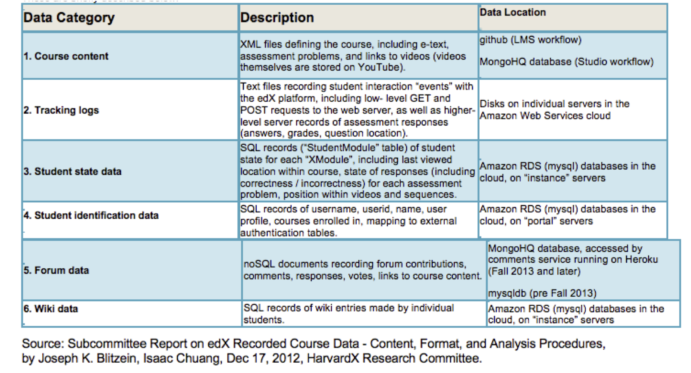
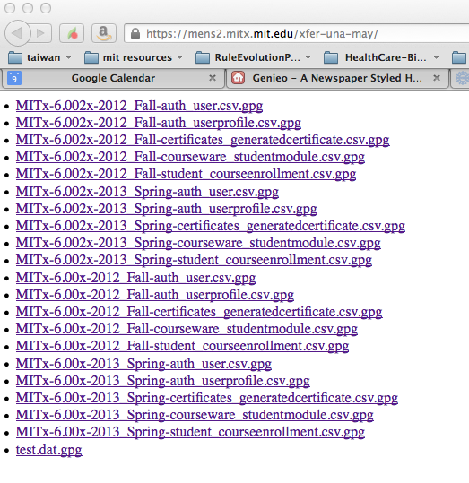
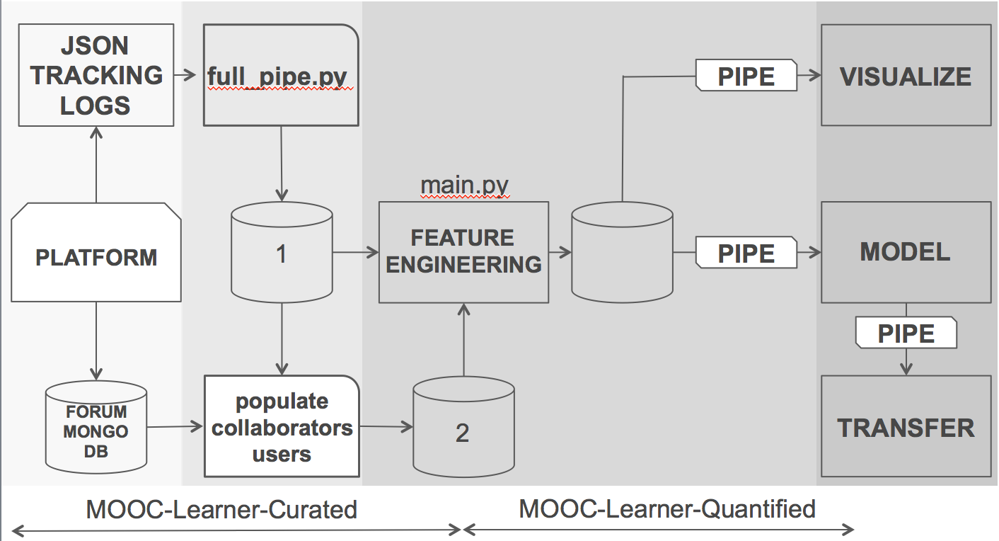
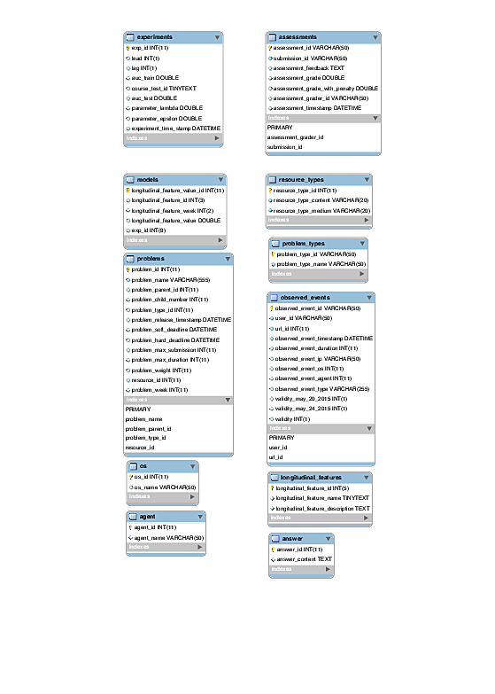
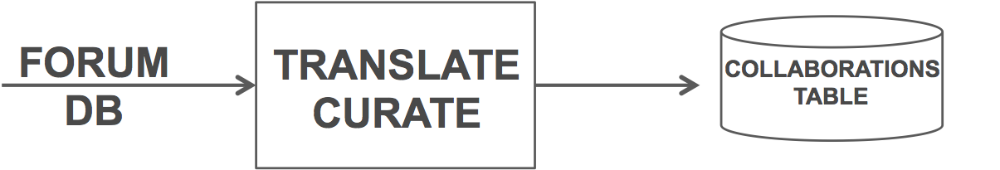

# TRANSLATE CURATE STEP OF WORKFLOW
[to TOC](https://github.mit.edu/ALFA-MOOC-HK/MOOC-Learner-Project/blob/master/README.md)
- _This code will be used by the team who will curate/translate the HKUST courses (e.g Intro to Java), develop GPU code for speedup._

## Table of Contents
- [PLATFORM OUTPUTS](#platform-outputs)
- [Documentation on Schema](#documentation-on-schema)
- [Graphics of Workflow](#graphics)
- [Tutorial on JSON LOG CURATION](#tutorial-on-json-log-curation)
- [FORUM DATA CURATION](#forum-data-curation)

## [PLATFORM OUTPUTS](#platform-outputs)
__The different streams of data captured from edX platform (2013)__

From first document describing file streams:[Subcommittee Report on edX Recorded Course Data – Content, Format, and Analysis Procedures ](edX-Recorded-Course-Data-17dec12a.pdf)

__Example of a file transfer of platform files. Note encryption. ALFA provided an encryption key and has a password-based gpg server running to decrypt__



<!-- nb. yes, forum files are missing.... -->

__Example for 6.002x of the files provided by MIT registrar before translation__
```
MITx-6.002x-2012_Fall___2014_03_29___tracking_log.json  MITx-6.002x-2012_Fall___2014_08_17___studentmodule.csv
MITx-6.002x-2012_Fall___2014_08_17___certificates.csv   MITx-6.002x-2012_Fall___2014_08_17___user_id_map.csv
MITx-6.002x-2012_Fall___2014_08_17___enrollment.csv     MITx-6.002x-2012_Fall___2014_08_17___users.csv
MITx-6.002x-2012_Fall___2014_08_17___forum.mongo        MITx-6.002x-2012_Fall___2014_08_17___wiki_article.csv
MITx-6.002x-2012_Fall___2014_08_17___profiles.csv       MITx-6.002x-2012_Fall___2014_08_17___wiki_articlerevision.csv
```
The set of files might not be minimal.

## Documentation of the Schema
Most up to date documentation of the schema includes users and collaborations tables. It can be found [here as pdf](MOOCDB_Schema_DOC.pdf) or at [moocdb.csail.mit.edu/wiki/index.php?title=MOOCdb](http://moocdb.csail.mit.edu/wiki/index.php?title=MOOCdb).  Other (very modest) documentation is in papers. See _Sebastien Boyer, Ben U. Gelman, Benjamin Schreck, and Kalyan Veeramachaneni. [Data science foundry for moocs](DataScienceFoundry-DSAA-2015.pdf). In Data Science and Advanced Analytics (DSAA), 2015. 36678 2015. IEEE International Conference on, pages 1–10. IEEE, 2015._

#### Graphic documentation of the Schema
We have 3 different EER graphics (derived using a sql tool):
-  [full schema](EERs/EERDiagram-20131122.pdf)
-  [schema from full_pipe.py, no collaborations or users tables](EERs/201x_2013_Spring_fullpipe_20161109.pdf)
-  [schema after digitalLearnerQuantified](EERs/201x_2013_spring_20161109.pdf)


The database from which  the schema documented above was derived is  a moocdb, a copy of which is on alfad7:

```
@alfad7:/scratch$ mysql -u root -p 201x_2013_spring -e "SHOW TABLES;"
```

## [Graphics of Workflow](#graphics)
__High Level__


__Details of Forum and JSON log processing:__
JSON log processing is required before the forum data is translated into the moocdb Users and Collaborations tables, but it is not strictly necessary before variable engineering.


## [TUTORIAL on JSON LOG CURATION](#tutorial-on-json-log-curation)


A [tutorial](../sample_tutorial/README.md) provides a hands on description on how to use a generated sample from your data and run the translate-curate step. The tutorial describes:
- Required folder structures, files and configuration file path names
- Folder structure created by MLC `full_pipe.py` script
- Translation of `*.json` files to intermediary `*.csv` files
- Processing of events in the intermediary `*.csv` files
- Creation of `MySQL` database for the data
- Filling of `MySQL` database for the data
- Curation of `MySQL` database


### Disk Space Requirements
You will need disk capacity about 3x the size of your tracking logs.

<!-- if we change full-pipe's name, this image is from the pptx in this directory. -->

### [FORUM DATA CURATION](#forum-data-curation)

Software is not available, task in process.  We have a moodb for 201x_2013_spring which has the forum data curated in it (compiled before loss of curation code). This will help any team member who needs to go forward in the workflow and use those tables (in variable engineering, visualizaiton or modeling)

Collaborations table is populated with forum data.

Examples from `201x_2013_spring`
```
mysql> DESCRIBE collaborations;
+----------------------------+--------------+------+-----+---------+-------+
| Field                      | Type         | Null | Key | Default | Extra |
+----------------------------+--------------+------+-----+---------+-------+
| collaboration_id           | varchar(255) | NO   | PRI | NULL    |       |
| user_id                    | varchar(255) | NO   | MUL | NULL    |       |
| collaboration_type_id      | int(11)      | NO   | MUL | NULL    |       |
| collaboration_content      | text         | NO   |     | NULL    |       |
| collaboration_timestamp    | datetime     | NO   |     | NULL    |       |
| collaboration_parent_id    | varchar(255) | YES  | MUL | NULL    |       |
| collaboration_child_number | int(11)      | YES  |     | NULL    |       |
| collaborations_ip          | varchar(50)  | YES  |     | NULL    |       |
| collaborations_os          | int(11)      | YES  |     | NULL    |       |
| collaborations_agent       | int(11)      | YES  |     | NULL    |       |
| resource_id                | int(11)      | YES  | MUL | NULL    |       |
+----------------------------+--------------+------+-----+---------+-------+
11 rows in set (0.00 sec)
```
[to TOC](https://github.mit.edu/ALFA-MOOC-HK/MOOC-Learner-Project/blob/master/README.md)
